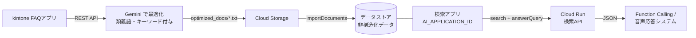

# gc-rag-engine

kintone に蓄積した FAQ を **Gemini Enterprise Agent Platform** に取り込み、自然言語の質問に対して
AI が生成した回答を返す RAG エンジンです。Cloud Run 上の HTTP API として公開し、
音声応答システムや Function Calling からの呼び出しを想定しています。

## 名称について

Google は 2026 年 4〜5 月にかけて Vertex AI / Vertex AI Agent Builder を
**Gemini Enterprise Agent Platform** に統合・改称しました。
この製品は改称が多く、検索すると複数の名前が混在してヒットします。実体はすべて同じです。

| 呼び名 | 位置づけ |
| :--- | :--- |
| Gemini Enterprise Agent Platform | 現在のプラットフォーム名（旧 Vertex AI） |
| **Agent Search** | その中の検索コンポーネント。本プロジェクトが使うのはここ |
| Vertex AI Search / AI Applications / Agent Builder | Agent Search の旧称 |
| Generative AI App Builder / Enterprise Search | さらに古い旧称。ドキュメントの URL に残っています |
| Discovery Engine | API・SDK 上の名前。**改称されていません** |

**コードへの影響はありません。**
API エンドポイントは `discoveryengine.googleapis.com` のまま、
クライアントライブラリも `@google-cloud/discoveryengine` のまま、
リソースパス（`collections/default_collection/engines/...`）も変わっていません。
既存のデータストアやアプリに移行作業は不要です。

変わったのは **コンソールの導線と画面上のラベル**です。
新規に構築する場合の手順は [初回構築](#初回構築) を参照してください。

---

## アーキテクチャ



処理は 2 系統に分かれます。

| 系統 | 実行契機 | エントリポイント | 役割 |
| :--- | :--- | :--- | :--- |
| 同期パイプライン | 手動 / 定期実行 | `npm run sync` | kintone → Gemini 最適化 → GCS → データストア再取り込み |
| 検索 API | リクエストごと | `npm start` (Cloud Run) | 検索 + 回答生成 |

---

## 必要要件

- **Node.js 22 以上**（依存ライブラリの要件）
- Google Cloud プロジェクト（`discoveryengine.googleapis.com` を有効化済み）
- Agent Search のデータストアと検索アプリ（[初回構築](#初回構築) 参照。LLM アドオン有効が必須）
- Google Cloud CLI (`gcloud`)
- Gemini API キー（[Google AI Studio](https://aistudio.google.com/)）
- FAQ を格納した kintone アプリと API トークン

---

## セットアップ

### 1. インストール

```bash
npm install
```

### 2. 環境変数

`.env.sample` をコピーして `.env` を作成します。

```bash
cp .env.sample .env
```

| 変数名 | 必須 | 説明 |
| :--- | :---: | :--- |
| `PROJECT_ID` | ✓ | プロジェクトID（文字列, 例: `my-project`） |
| `PROJECT_NUMBER` | ✓ | プロジェクト番号（数値, 例: `123456789012`）。検索 API のリソースパスに使う |
| `LOCATION` | ✓ | リージョン。通常は `global` |
| `AI_APPLICATION_ID` | ✓ | 検索アプリ（エンジン）のID |
| `DATA_STORE_ID` | 同期時 | データストアID。再取り込み先 |
| `GCS_BUCKET` | 同期時 | 最適化済みドキュメントを置くバケット名 |
| `GCS_PREFIX` | | バケット内のフォルダ（既定 `faq_docs`） |
| `GEMINI_API_KEY` | 同期時 | Gemini API キー。旧名 `API_KEY` も読めます |
| `GEMINI_MODEL` | | 最適化に使うモデル（既定 `gemini-3.7-flash`） |
| `GEMINI_THINKING_LEVEL` | | `low` / `medium` / `high`。空でモデル既定（既定 `low`） |
| `OPTIMIZE_CONCURRENCY` | | 最適化の同時実行数（既定 `3`） |
| `OPTIMIZE_MAX_RETRIES` | | レート制限時の最大リトライ回数（既定 `4`） |
| `KINTONE_DOMAIN` | 同期時 | 例: `example.cybozu.com` |
| `KINTONE_APP_ID` | 同期時 | FAQ アプリのID |
| `KINTONE_API_TOKEN` | 同期時 | レコード閲覧権限のある API トークン |
| `KINTONE_GUEST_SPACE_ID` | | ゲストスペース配下のアプリの場合のみ |
| `KINTONE_QUESTION_FIELD` | | 質問のフィールドコード（既定 `question`） |
| `KINTONE_ANSWER_FIELD` | | 回答のフィールドコード（既定 `answer`） |
| `SEARCH_PREAMBLE` | | 回答生成のプロンプト前置き。既定は「音声での返答を想定…200文字以内」 |
| `ANSWER_MAX_REFERENCES` | | レスポンスに含める参照数（既定 `3`） |
| `SEARCH_PAGE_SIZE` | | 検索の取得件数（既定 `10`） |
| `SMOKE_TEST_QUERY` | | パイプライン最後の疎通確認クエリ |
| `LOG_LEVEL` | | `debug` / `info` / `warn` / `error`（既定 `info`） |
| `PORT` | | サーバの待ち受けポート（既定 `8080`。Cloud Run が自動設定） |
| `CLOUD_RUN_SERVICE` | | デプロイ先サービス名（既定 `rag-engine-service`） |
| `CLOUD_RUN_REGION` | | デプロイ先リージョン（既定 `asia-northeast1`） |
| `CLOUD_RUN_SERVICE_ACCOUNT` | | 実行サービスアカウント（既定 `rag-app-runner@<PROJECT_ID>.iam.gserviceaccount.com`） |

不足している変数はコマンド実行時にまとめて指摘されます。

### 3. Google Cloud 認証

```bash
gcloud auth login
gcloud config set project [PROJECT_ID]
gcloud auth application-default login   # ライブラリ用の認証情報 (ADC)
```

### 4. kintone アプリの準備

- FAQ アプリに質問・回答のフィールドを用意します。
  フィールドコードの既定値は `question` / `answer` です。異なる場合は
  `KINTONE_QUESTION_FIELD` / `KINTONE_ANSWER_FIELD` で指定してください。
- アプリの API トークンを発行し、**レコード閲覧**権限を付けます。
- ゲストスペース配下のアプリは `KINTONE_GUEST_SPACE_ID` も設定します。

---

## 初回構築

### 1. Cloud Storage バケットを作る

```bash
gcloud storage buckets create gs://[YOUR_BUCKET] --location=asia-northeast1
```

### 2. Agent Platform でデータストアと検索アプリを作る

> **コンソールの導線が変わりました**
> Agent Platform への統合に伴い、旧「Vertex AI Agent Builder」「AI Applications」の画面は
> **Agent Search** という名前で Agent Platform 配下に移動しました。
> ただし **リソースの構造（データストア / アプリ = エンジン）と API は変わっていません**。
> ドキュメントやコンソールで使われている `console.cloud.google.com/gen-app-builder/...` の
> URL も引き続き有効です。本 README ではその URL を直接示します。

#### 2-0. API の有効化

```bash
gcloud services enable discoveryengine.googleapis.com
```

初回はコンソールから[Agent Search の開始ページ](https://console.cloud.google.com/gen-app-builder/start)を開き、
データ利用規約を確認したうえで **「続行して API を有効にする」** を押す必要があります。

この先のデータストア・アプリ作成には `roles/discoveryengine.admin` が必要です。
付与方法は [3. IAM](#3-iam) を参照してください
（プロジェクトのオーナーであれば追加作業は不要です）。

#### 2-1. データストアを作る

コンソールで作る場合:

1. [データストアの作成](https://console.cloud.google.com/gen-app-builder/data-stores/create) を開きます。
2. データソースに **Cloud Storage** を選びます。
3. **「非構造化ドキュメント（PDF、HTML、TXT など）」** を選びます。
   本プロジェクトは `.txt` を投入するので、ここを構造化データにすると取り込みに失敗します。
4. **フォルダ** を選び、`gs://[YOUR_BUCKET]/faq_docs` を指定します。
5. ロケーションは **`global (Global)`** を選びます（`.env` の `LOCATION` と必ず一致させてください）。
6. 名前を入力すると **データストアID** が発番されます。これを `DATA_STORE_ID` に設定します。

REST で作る場合（構成をコードで再現したいとき）:

```bash
curl -X POST \
  -H "Authorization: Bearer $(gcloud auth print-access-token)" \
  -H "Content-Type: application/json" \
  -H "X-Goog-User-Project: ${PROJECT_ID}" \
  "https://discoveryengine.googleapis.com/v1/projects/${PROJECT_ID}/locations/global/collections/default_collection/dataStores?dataStoreId=${DATA_STORE_ID}" \
  -d '{
    "displayName": "FAQ Data Store",
    "industryVertical": "GENERIC",
    "solutionTypes": ["SOLUTION_TYPE_SEARCH"],
    "contentConfig": "CONTENT_REQUIRED"
  }'
```

`contentConfig: CONTENT_REQUIRED` が非構造化ドキュメント（本文を持つドキュメント）用の設定です。

> **取り込み元の指定について**
> コンソールの作成フローでは GCS のパス指定が必須ですが、REST では**空のデータストアを作れます**。
> どちらで作っても、以後のドキュメント投入は `npm run sync` が
> `importDocuments`（`reconciliationMode: FULL`）で行うため、
> コンソールで指定したパスは初回取り込みにしか使われません。
> `.env` の `GCS_BUCKET` / `GCS_PREFIX` と食い違わないようにだけ注意してください。

#### 2-2. 検索アプリ（エンジン）を作る

コンソールで作る場合:

1. [アプリの作成](https://console.cloud.google.com/gen-app-builder/engines/create) を開きます。
2. **① 種類** — **「検索とアシスタント」** タブの **「カスタム検索（一般）」** で「作成」を押します。

   | 選択肢 | 用途 |
   | :--- | :--- |
   | **カスタム検索（一般）** | **← これ。** 内部ファイル・非構造化データの検索（`industryVertical: GENERIC`） |
   | Gemini Enterprise | 社内向けアシスタント製品。本プロジェクトの検索 API とは別物 |
   | カスタム検索（医療データ） | ヘルスケア専用 |
   | AI モードでのサイト内検索 | 公開ウェブサイトのクロール用。GCS 上のファイルは対象外 |
   | メディア検索 / AI Commerce Search | 動画・画像向け / 小売カタログ向け |

3. **② 構成** — アプリ名と会社名を入力し、ロケーションに **`global (Global)`** を選びます
   （2-1 のデータストアおよび `.env` の `LOCATION` と必ず揃えます）。
4. 同じ画面の **「Enterprise エディションの機能」** — 本プロジェクトでは **不要**です。
   ウェブサイト検索やアプリのリージョン指定が必要な場合のみ有効にします（追加費用がかかります）。
5. 同じ画面の **「高度な LLM 機能」/「生成レスポンス」** — **必ず有効にしてください。**
   これが検索サマリー（`answerQuery`）を有効にする設定で、無効のままだと
   `src/search.js` の回答生成がエラーになり、`answer` が返りません。
6. **③ データ** — 2-1 で作ったデータストアを選択します。
7. 発番された **アプリID** を `AI_APPLICATION_ID` に設定します。

> 画面のラベルはコンソールの更新で変わることがあります。表記が違っていたら、
> 後述の REST 例の `solutionType` / `industryVertical` / `searchEngineConfig` と
> 同じ設定になるものを選び、作成後に 2-3 で実際の値を確認してください。

> ⚠️ **アプリにデータストアを 1 つだけ紐付けた場合、後から外したり別のものを追加したりできません。**
> データストアを作り直すときはアプリごと作り直すことになるので、ID の付け方は最初に決めておくのが安全です。

REST で作る場合:

```bash
curl -X POST \
  -H "Authorization: Bearer $(gcloud auth print-access-token)" \
  -H "Content-Type: application/json" \
  -H "X-Goog-User-Project: ${PROJECT_ID}" \
  "https://discoveryengine.googleapis.com/v1/projects/${PROJECT_ID}/locations/global/collections/default_collection/engines?engineId=${AI_APPLICATION_ID}" \
  -d '{
    "displayName": "FAQ Search App",
    "dataStoreIds": ["'"${DATA_STORE_ID}"'"],
    "solutionType": "SOLUTION_TYPE_SEARCH",
    "industryVertical": "GENERIC",
    "searchEngineConfig": {
      "searchTier": "SEARCH_TIER_STANDARD",
      "searchAddOns": ["SEARCH_ADD_ON_LLM"]
    }
  }'
```

| フィールド | 本プロジェクトでの値 | 意味 |
| :--- | :--- | :--- |
| `solutionType` | `SOLUTION_TYPE_SEARCH` | 検索アプリ |
| `industryVertical` | `GENERIC` | 汎用（メディア・小売以外） |
| `searchTier` | `SEARCH_TIER_STANDARD` | 標準ティア。Enterprise は不要 |
| `searchAddOns` | `["SEARCH_ADD_ON_LLM"]` | **回答生成に必須** |

#### 2-3. 設定が正しいか確認する

コンソールのトグルは名称が変わることがあるため、実際の設定値を API で確認するのが確実です。

```bash
curl -s -H "Authorization: Bearer $(gcloud auth print-access-token)" \
  "https://discoveryengine.googleapis.com/v1/projects/${PROJECT_ID}/locations/${LOCATION}/collections/default_collection/engines/${AI_APPLICATION_ID}"
```

レスポンスの `searchEngineConfig.searchAddOns` に `SEARCH_ADD_ON_LLM` が含まれていれば、
回答生成（`answerQuery`）が使える状態です。

> 管理系の API（データストア／アプリの作成・参照）はリソースパスに `PROJECT_ID` と
> `PROJECT_NUMBER` のどちらでも使えます。上の例は Google の公式ドキュメントに合わせて
> `PROJECT_ID` を使っています。

#### 2-4. `.env` に反映する

| `.env` の変数 | 設定する値 |
| :--- | :--- |
| `PROJECT_ID` | プロジェクトID（文字列） |
| `PROJECT_NUMBER` | プロジェクト番号（数値）。検索 API のリソースパスに使います |
| `LOCATION` | データストア／アプリのロケーション（上記手順なら `global`） |
| `DATA_STORE_ID` | 2-1 のデータストアID |
| `AI_APPLICATION_ID` | 2-2 のアプリID（= エンジンID） |

> `PROJECT_ID` と `PROJECT_NUMBER` の両方が必要です。
> 検索アプリのリソースパスはプロジェクト**番号**で構成されるため、文字列IDだけでは動きません。

### 3. IAM

**誰に何を付けるか。** 登場する主体は 2 つだけです。**どちらに付けるかを間違えると動きません。**

| 主体 | 正体 | 担当 | 用意する場所 |
| :--- | :--- | :--- | :--- |
| **あなた（開発者）** | Google アカウント（`gcloud auth login` したもの） | 構築、`npm run sync`、`./deploy.sh` | 既存（3-2 でロールを付与） |
| **`rag-app-runner`** | サービスアカウント（Cloud Run にアタッチ） | 検索 API の実行のみ | **[3-3](#3-3-cloud-run-実行用サービスアカウントを作る) で新規作成** |

この節を 3-1 → 3-5 の順に実行すれば、サービスアカウントの作成まで含めて一通り揃います。

> **よくある勘違い**
> ローカルで実行する `npm run sync` は **ADC（あなたのユーザーアカウント）** で認証されます。
> サービスアカウントは使いません。同期に必要なロールを `rag-app-runner` に付けても効かないので、
> **あなたのアカウントに付けてください。**

#### 3-1. 変数を用意する

以降のコマンドで使い回します。`PROJECT_NUMBER` はここで取得して `.env` にも設定してください。

```bash
export PROJECT_ID=$(gcloud config get-value project)
export PROJECT_NUMBER=$(gcloud projects describe "$PROJECT_ID" --format='value(projectNumber)')
export USER_EMAIL=$(gcloud config get-value account)

# 「初回構築 1」で作ったバケット名 (.env の GCS_BUCKET と同じ値)
export GCS_BUCKET=your-bucket-name

# Cloud Run 実行用サービスアカウントのメールアドレス。
# ここでは文字列を組み立てているだけで、SA の実体は 3-3 で作成します。
export RUNNER_SA="rag-app-runner@${PROJECT_ID}.iam.gserviceaccount.com"

echo "PROJECT_ID=$PROJECT_ID"
echo "PROJECT_NUMBER=$PROJECT_NUMBER"
echo "USER_EMAIL=$USER_EMAIL"
echo "RUNNER_SA=$RUNNER_SA"
```

#### 3-2. 開発者アカウントに付与する（構築・同期用）

| ロール | 必要な理由 |
| :--- | :--- |
| `roles/discoveryengine.admin` | データストア・アプリの作成と、`npm run sync` のドキュメント取り込み |
| `roles/storage.objectAdmin` | `optimized_docs/` の GCS へのアップロードと不要ファイル削除 |

```bash
gcloud projects add-iam-policy-binding "$PROJECT_ID" \
  --member="user:${USER_EMAIL}" \
  --role="roles/discoveryengine.admin"

# GCS はバケット単位に絞ったほうが安全
gcloud storage buckets add-iam-policy-binding "gs://${GCS_BUCKET}" \
  --member="user:${USER_EMAIL}" \
  --role="roles/storage.objectAdmin"
```

> プロジェクトのオーナー（`roles/owner`）であればどちらも含まれているため、この手順は不要です。
> 構築が終わったあと、取り込みだけなら `roles/discoveryengine.admin` を
> `roles/discoveryengine.editor` に落とせます（作成権限が外れます）。

#### 3-3. Cloud Run 実行用サービスアカウントを作る

**ここで新規に作成します。** 事前に用意しておく必要はありません。

```bash
# 1. サービスアカウントを作成する
gcloud iam service-accounts create rag-app-runner \
  --display-name="RAG App Runner"

# 2. 検索を実行する権限だけを付ける
gcloud projects add-iam-policy-binding "$PROJECT_ID" \
  --member="serviceAccount:${RUNNER_SA}" \
  --role="roles/discoveryengine.user"

# 3. できたか確認する
gcloud iam service-accounts describe "$RUNNER_SA" --format='value(email)'
```

この SA は検索と回答生成しかしません。GCS も kintone も Gemini API も触らないため、
付けるロールは `roles/discoveryengine.user` の 1 つだけです。
**キーファイル（JSON）は作成しません。** Cloud Run にアタッチして使います。

> 既に同名の SA がある場合、手順 1 は `ALREADY_EXISTS` で失敗しますが問題ありません。
> そのまま手順 2 に進んでください。
> 別の名前にしたい場合は `RUNNER_SA` を読み替え、`.env` の
> `CLOUD_RUN_SERVICE_ACCOUNT` にそのアドレスを設定してください（`deploy.sh` が参照します）。

#### 3-4. デプロイに必要な権限

`./deploy.sh` でデプロイする場合のみ必要です。

`gcloud run deploy --source .` は Cloud Build でコンテナをビルドするため、
検索・同期とは別の権限が要ります。

まず API を有効にします。

```bash
gcloud services enable \
  run.googleapis.com \
  cloudbuild.googleapis.com \
  artifactregistry.googleapis.com
```

あなたのアカウントに付与します。

```bash
gcloud projects add-iam-policy-binding "$PROJECT_ID" \
  --member="user:${USER_EMAIL}" --role="roles/run.sourceDeveloper"

gcloud projects add-iam-policy-binding "$PROJECT_ID" \
  --member="user:${USER_EMAIL}" --role="roles/serviceusage.serviceUsageConsumer"

# rag-app-runner を Cloud Run にアタッチするための権限。
# プロジェクトではなく「SA に対して」付与する点に注意 (忘れやすい)
gcloud iam service-accounts add-iam-policy-binding "$RUNNER_SA" \
  --member="user:${USER_EMAIL}" --role="roles/iam.serviceAccountUser"
```

ビルドを実行するサービスアカウントに付与します。

```bash
gcloud projects add-iam-policy-binding "$PROJECT_ID" \
  --member="serviceAccount:${PROJECT_NUMBER}-compute@developer.gserviceaccount.com" \
  --role="roles/run.builder"
```

#### 3-5. 付与できたか確認する

```bash
# 自分のアカウント
gcloud projects get-iam-policy "$PROJECT_ID" \
  --flatten="bindings[].members" \
  --filter="bindings.members:${USER_EMAIL}" \
  --format="table(bindings.role)"

# 実行用サービスアカウント
gcloud projects get-iam-policy "$PROJECT_ID" \
  --flatten="bindings[].members" \
  --filter="bindings.members:${RUNNER_SA}" \
  --format="table(bindings.role)"
```

IAM の変更が反映されるまで最大で数分かかることがあります。
付与直後に `PERMISSION_DENIED` が出た場合は少し待ってから再試行してください。

### 4. 初回同期

```bash
npm run sync:full
```

---

## 同期パイプラインの運用

```bash
npm run sync           # 差分同期（通常はこれ）
npm run sync:full      # 差分を無視して全件再生成
npm run sync:resume    # 中断したインポートの待機を再開
npm run sync -- --help # オプション一覧
```

パイプラインは 4 ステップで進みます。

1. **kintone → Gemini 最適化** — FAQ を取得し、類義語・キーワード・想定検索クエリを付与した
   テキストを `optimized_docs/faq_<レコードID>.txt` に出力します。
2. **GCS アップロード** — `optimized_docs/` を `gs://$GCS_BUCKET/$GCS_PREFIX/` に同期します。
   ローカルに無い `.txt` はバケットからも削除されます。
3. **データストア再取り込み** — `reconciliationMode: FULL` でインポートし、完了までポーリングします。
4. **スモークテスト** — 実際に 1 件検索し、回答が返るか確認します。

### 差分同期の仕組み

質問+回答の SHA-1 を `.optimize_state.json` に記録し、**変化したレコードだけ** Gemini に投げます。
kintone 側で削除されたレコードのファイルはローカル・GCS の両方から取り除かれます。
変更が 1 件も無ければステップ 1 で終了します。

`.optimize_state.json` を消すと全件再生成になります（`--full` と同じ効果）。

### 中断したときは

インポートは数十分かかることがあります。Operation 名は `.last_import_operation.json` に
保存されているため、途中で止めても待機だけやり直せます。

```bash
npm run sync:resume
```

ネットワークの瞬断（`EHOSTUNREACH` など）や 5xx は自動でリトライするので、
通常は放置して問題ありません。

### 個別ステップのスキップ

| オプション | 効果 |
| :--- | :--- |
| `--skip-optimize` | kintone 取得と Gemini 最適化を飛ばす（kintone / Gemini の環境変数も不要になる） |
| `--skip-upload` | GCS アップロードを飛ばす |
| `--skip-import` | データストア再取り込みを飛ばす |
| `--skip-smoke` | スモークテストを飛ばす |

例: 生成結果だけ確認したい（GCS もデータストアも触らない）

```bash
npm run sync -- --skip-upload --skip-import --skip-smoke
```

---

## 動作確認

```bash
# CLI から検索
npm run search -- "解約方法について教えて下さい"

# ローカルでサーバ起動
npm start
curl -X POST http://localhost:8080/search \
  -H 'Content-Type: application/json' \
  -d '{"q": "解約方法を教えて"}'

# 単体テスト
npm test
```

---

## トラブルシューティング

### 検索結果は返るが `answer` が `null` になる

アプリの **LLM アドオン（生成レスポンス）が無効**です。
[2-3 の確認コマンド](#2-3-設定が正しいか確認する)で `searchEngineConfig.searchAddOns` を確認してください。
`SEARCH_ADD_ON_LLM` が入っていなければ、コンソールのアプリ設定で
**「高度な LLM 機能」/「生成レスポンス」** を有効にします。

### `NOT_FOUND` / `PERMISSION_DENIED` になる

| 原因 | 確認点 |
| :--- | :--- |
| `PROJECT_NUMBER` にプロジェクト**ID**（文字列）を入れている | 検索アプリのリソースパスは数値のプロジェクト番号で構成されます |
| `LOCATION` がデータストア／アプリのロケーションと違う | データストアを `global` で作ったなら `LOCATION=global` |
| `AI_APPLICATION_ID` がアプリの表示名になっている | 必要なのは発番されたID（例: `faq-search-app_1712...`） |
| ADC が別プロジェクトを向いている | `gcloud auth application-default login` をやり直す |
| ロールが足りない／付与直後 | [3-5 の確認コマンド](#3-5-付与できたか確認する)で確認。反映に数分かかることがあります |

### `npm run sync` だけ権限エラーになる

同期はサービスアカウントではなく **ADC（`gcloud auth login` したあなたのアカウント）** で動きます。
`rag-app-runner` にロールを付けても効きません。[3-2](#3-2-開発者アカウントに付与する構築同期用) を確認してください。

現在どのアカウントで認証されているかは次で確認できます。

```bash
gcloud auth application-default print-access-token >/dev/null && \
  gcloud config get-value account
```

### `./deploy.sh` が権限エラーで失敗する

| エラーの内容 | 対処 |
| :--- | :--- |
| `iam.serviceaccounts.actAs` が無い | `rag-app-runner` に対する `roles/iam.serviceAccountUser` が未付与。[3-4](#3-4-デプロイに必要な権限) の SA 単位の付与コマンドを実行 |
| ビルドが権限で失敗する | Compute Engine 既定 SA への `roles/run.builder` が未付与 |
| `run.services.create` が無い | 自分のアカウントに `roles/run.sourceDeveloper` が未付与 |
| API が無効 | `gcloud services enable run.googleapis.com cloudbuild.googleapis.com artifactregistry.googleapis.com` |

組織ポリシー（`constraints/iam.allowedPolicyMemberDomains`）で `allUsers` が禁止されている環境では
`--allow-unauthenticated` が拒否されます。その場合は `deploy.sh` からこのフラグを外し、
呼び出し側に `roles/run.invoker` を付与して認証付きで呼び出してください。

### 検索しても 0 件で、回答も出ない

1. インポートが完了しているか確認します。コンソールのデータストア詳細 → **アクティビティ**タブで
   「インポート完了」になっているかを見ます（数十分かかることがあります）。
2. `GCS_PREFIX` とデータストア作成時に指定したフォルダが一致しているか確認します。
   `npm run sync` は `gs://$GCS_BUCKET/$GCS_PREFIX/*.txt` を取り込みます。
3. `optimized_docs/` にファイルが生成されているか確認します。

### コンソールでアプリが見つからない

Agent Platform への統合でメニュー位置が変わっています。
[https://console.cloud.google.com/gen-app-builder/engines](https://console.cloud.google.com/gen-app-builder/engines)
を直接開くか、コンソール検索で「Agent Search」または「AI Applications」を探してください。

### インポートで大量に失敗する

データストアの `contentConfig` が非構造化ドキュメント用（`CONTENT_REQUIRED`）になっているか確認します。
構造化データとして作ったデータストアには `.txt` を `dataSchema: content` で投入できません。
この設定は作成後に変更できないため、データストアを作り直す必要があります。

---

## Cloud Run へのデプロイ

サービスアカウントキー（JSON）は使わず、専用のサービスアカウントをアタッチして実行します。

事前に [3-3](#3-3-cloud-run-実行用サービスアカウントを作る) と
[3-4](#3-4-デプロイに必要な権限) を済ませてください。

```bash
./deploy.sh
```

`.env` から検索 API の実行に必要な変数だけを Cloud Run に渡します。
**Gemini API キーと kintone の認証情報は同期パイプライン専用のため、Cloud Run には渡しません。**

---

## API 仕様

**Service URL**: `https://rag-engine-service-xxxxxxxxx-an.a.run.app`（環境により異なります）

未認証アクセスを許可しています（Function Calling からの呼び出しを容易にするため、
`deploy.sh` で `--allow-unauthenticated` を指定）。

### `POST /search` / `GET /search`

**リクエスト（POST）**

```json
{ "q": "検索したいキーワードや質問" }
```

GET の場合は `/search?q=...` です。

**レスポンス**

```json
{
  "answer": "AIによる生成された回答...",
  "references": [
    { "title": "ドキュメントタイトル", "link": "gs://..." }
  ],
  "relatedQuestions": ["関連する質問1", "関連する質問2"]
}
```

回答を生成できなかった場合、`answer` は `null` になります。

**エラー**

| ステータス | 条件 |
| :--- | :--- |
| `400` | `q` が空、または指定されていない |
| `500` | 検索・回答生成に失敗 |

**使用例**

```bash
curl -X POST https://[YOUR_SERVICE_URL]/search \
  -H "Content-Type: application/json" \
  -d '{"q": "解約方法を教えて"}'
```

### `GET /healthz`

```json
{ "status": "ok" }
```

---

## ファイル構成

```
index.js                  Cloud Run のエントリポイント
bin/
  search.js               CLI: 単発の検索 (npm run search)
  sync.js                 CLI: 同期パイプライン (npm run sync)
src/
  config.js               環境変数の読み込みと検証
  logger.js               構造化ログ (Cloud Run では JSON 出力)
  server.js               Express アプリ + graceful shutdown
  search.js               検索 + 回答生成 (Discovery Engine v1)
  optimize.js             Gemini による FAQ 最適化・差分管理
  sources/kintone.js      kintone からの FAQ 取得
  gcs.js                  Cloud Storage への同期
  datastore.js            データストア取り込みと Operation ポーリング
  pipeline.js             同期パイプラインのオーケストレーション
test/                     node:test による単体テスト
deploy.sh                 Cloud Run へのデプロイ
optimized_docs/           最適化済みドキュメントの出力先 (gitignore)
```

生成される状態ファイル（いずれも gitignore 済み）:

- `.optimize_state.json` — レコードごとのハッシュ。差分同期に使う
- `.last_import_operation.json` — 実行中のインポート Operation 名

---

## v1.x からの変更点

- **データソースが CSV から kintone に変わりました。** `faq_data.csv` と
  `optimize_with_llm.js` の CSV 読み込みは廃止されています。
- **Gemini SDK を `@google/genai` に移行しました。** 旧 `@google/generative-ai` は
  2025-11-30 に非推奨化されています。既定モデルも `gemini-3.7-flash` になりました。
- **検索 API を v1alpha から v1 (GA) に移行しました。** 機能差はありません。
- **ファイルを `src/` と `bin/` に再構成しました。** `query.js` / `run_pipeline.js` /
  `optimize_with_llm.js` は廃止され、`src/` 配下のモジュールに分割されています。
- **Node.js 22 以上が必要になりました。**
- `API_KEY` は `GEMINI_API_KEY` に改称しました（旧名も引き続き読めます）。
